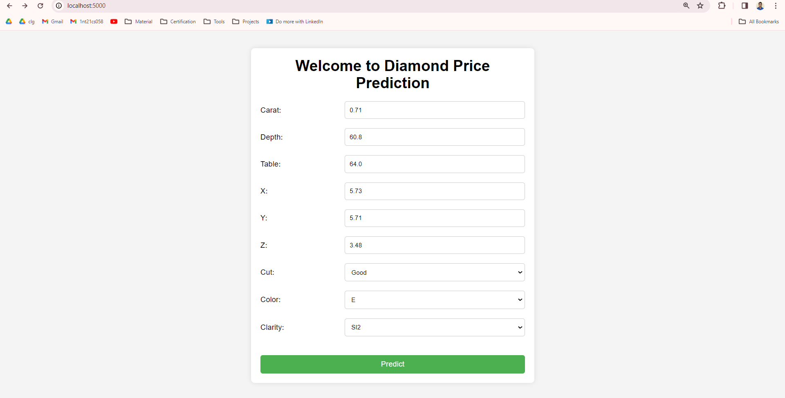
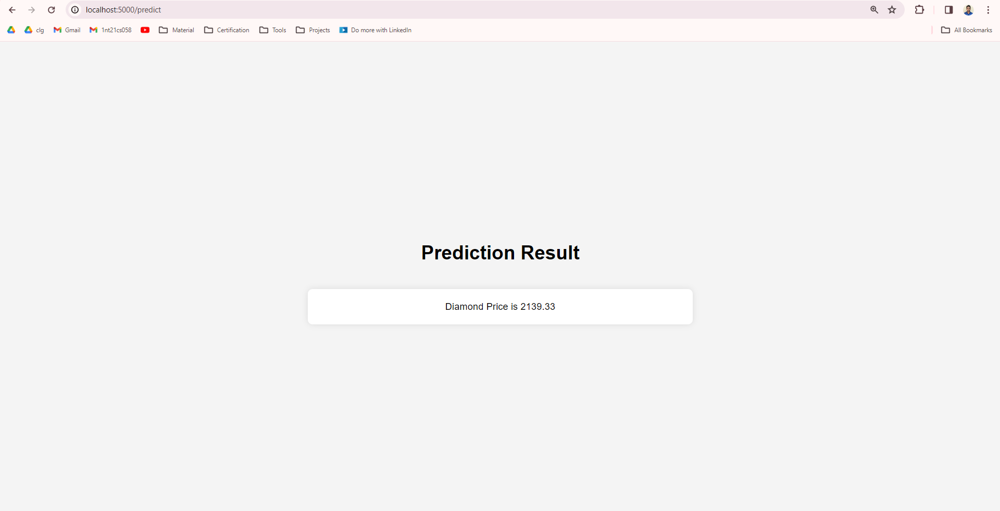
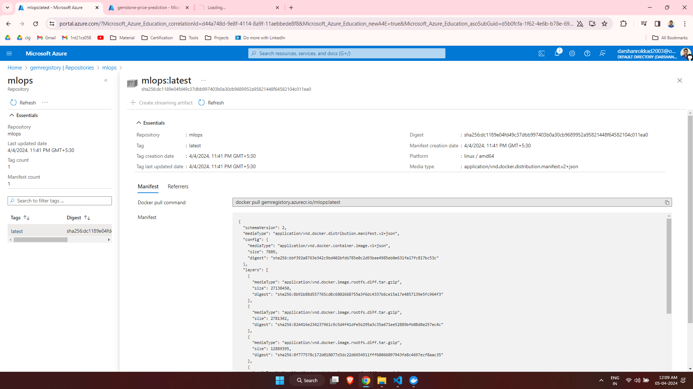

<h1 align="center">:gem: Gem Stone Price :dollar: Prediction</h1>  

---

<h3 align="center">Problem Statement</h3>

There are 10 independent variables (including id):

id : unique identifier of each diamond

carat : Carat (ct.) refers to the unique unit of weight measurement used exclusively to weigh gemstones and diamonds.

cut : Quality of Diamond Cut

color : Color of Diamond

clarity : Diamond clarity is a measure of the purity and rarity of the stone, graded by the visibility of these characteristics under 10-power magnification.

depth : The depth of diamond is its height (in millimeters) measured from the culet (bottom tip) to the table (flat, top surface)

table : A diamond's table is the facet which can be seen when the stone is viewed face up.

x : Diamond X dimension

y : Diamond Y dimension

x : Diamond Z dimension

Target variable:

price: Price of the given Diamond.

Dataset Link : [Regression with a Tabular Gemstone Price Dataset](https://www.kaggle.com/c/playground-series-s3e8/data)

---

<h3 align="center">Solution Explaination</h3>

Click the below image to see vedio solution explaination

[](https://www.linkedin.com/posts/darshan-r-m_mlops-gemstoneprediction-datascience-activity-7181954040195428353-e9Ew?utm_source=share&utm_medium=member_desktop)

---

<h3 align="center">Approch for the problem</h3>

The problem solving approch

---

<h3 align="center">Project UI</h3>

<p align="center"></p>
<p align="center"></p>

---

<h3 align="center">API Testing Results</h3>

<p align="center"></p>

---

<h3 align="center">Mlflow integration</h3>

<p align="center"></p>

---

<h3 align="center">Airflow integration</h3>

<p align="center"></p>
<p align="center"></p>

---

<h3 align="center">Deployment 1 - Using Azure</h3>

<p align="center"></p>  
<p align="center"></p>  
<p align="center"></p>  
<p align="center"></p>  

---

<h3 align="center">Deployment 2 - Using AWS Elastic Beanstalk(EBS)</h3>

Step 1 : Created role for AWS EBS ('gem_stone_deploy_role') and AWS code pipeline ('gem_stone_pipeline_role').  
Step 2 : Created AWS EBS application and launched EBS environment with certian configuration.  
Step 3 : Created AWS Code pipeline to connect github to EBS.  
Step 4 : Waiting for Deployment and then accessing application using domain given in AWS EBS.  

<p align="center"></p>  
<p align="center"></p>  
<p align="center"></p>  
<p align="center"></p>  

Note : As there were so many conflicts in the branch i have deleted both the azure deployment and ebs deployment branch

---

<h3 align="center">Project Structure</h3>

```
│
├── .github
│   │
│   └── workflow
│       │
│       └── main.yml                         <-- contains yml code to create CI-CD pipeline for github actions
│
├── artificats                               <-- Contains dataset(train, test and raw) and pickle files(preprocessor and model)
│
├── images                                   <-- contains images used in readme file
│
├── notebooks
│   │
│   └── experiment.ipynb                     <-- a jupyter notebook where eda and model training is performed
│
├── resources                                <-- folder contains some usefull commands and steps used while build project
│
├── src
│   │
│   ├── components
│   │   │
│   │   ├── data_ingestion.py             <-- module which reads data from different data source and do train test split
│   │   │                                        then save raw data, train data and test data inside artifact folder
│   │   │
│   │   ├── data_transformation.py        <-- module which takes training and test dataset and then do feature engineering
│   │   │                                        then save preprocessor as pickle file inside artifact folder
│   │   │
│   │   ├── model_training.py             <-- module which takes preprocessed training and test data and
│   │   │                                        this data is used to train different models and selects best model
│   │   │                                        it also perform hyperparameter tuning
│   │   │
│   │   │
│   │   └── model_evaluation.py           <-- module which calculate the performance metrics
│   │
│   ├── pipeline
│   │   │
│   │   ├── __init__.py
│   │   │
│   │   ├── training_pipeline.py          <-- module used to train the model using training components
│   │   │
│   │   └── prediction_pipeline.py        <-- module takes the input data given by user through flask web application and returns the prediction
│   │
│   ├── __init__.py
│   │
│   ├── exception.py                         <-- module to display the custom exception
│   │
│   ├── logger.py                            <-- module to create log folder for each execution and log the events whenever required.
│   │
│   └── utils.py                             <-- module to which contians functions that are commonly used.
│
├── static
│   │
│   └── css                                  <-- contains all css files
│
├── templates                                <-- contains all html files
│
├── .gitignore                               <-- used to ignore the unwanted file and folders
│
├── application.py                           <-- flask web application to take input from user and render output
│
├── init_setup.sh                            <-- file is likely a shell script used to initailize the setup
│
├── LICENSE                                  <-- copyright license for the github repository
│
├── README.md                                <-- used to display the information about the project
│
├── requirements_dev.txt                     <-- text file which contain the dependencies in development environment
│
├── requirements.txt                         <-- text file which contain the dependencies/packages used in project
│
├── setup.py                                 <-- python script used for building python packages of the project
│
└── template.py                              <-- program used to create the project structure
```

---
